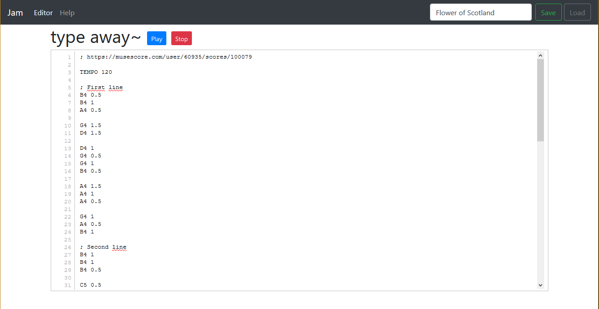

# jam - play some music through your PC speakers



## Prerequisites

* A Linux box if you want to actually make your motherboard beep. 
* Otherwise, any platform supported by Go should work.
* A working Go installation if you want to use the development version.

## Installation

If you want a relatively stable version (no promises!), head over to the 
[Releases](https://github.com/simsor/jam/releases) section, or launch 
the [Web app](https://jam.sixfoisneuf.fr).

If you want the latest development version, just grab it with ``go get``
```
go get github.com/simsor/jam
```

That's it! type ``jam -h`` to see the help.
